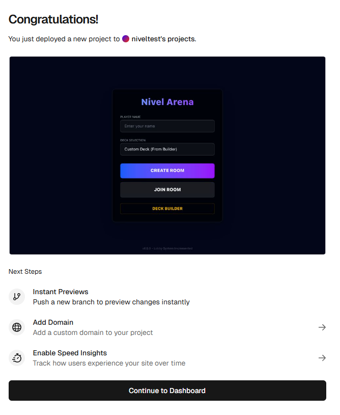

# オンラインテストプレイ環境 完成報告

おめでとうございます！プロジェクトの GitHub アップロードから Render (サーバー) および Vercel (画面) へのデプロイがすべて完了しました。

## 🚀 公開された URL

- **ゲーム画面 (Vercel)**: `https://nivel-arena-online.vercel.app` (または Vercel 画面に表示されている URL)
- **ゲームサーバー (Render)**: `https://nivel-arena-server-96ie.onrender.com`

## 🛠 実施した主な修正内容

1. **接続設定の完全な環境変数化**: `GameBoard.tsx` だけでなく、`Lobby.tsx` や `DeckBuilder.tsx` に残っていた `localhost` への接続設定をすべて環境変数 (`NEXT_PUBLIC_SOCKET_URL`) を参照するように修正しました。これにより、本番環境で確実に通信ができるようになりました。
2. **本番用サーバー設定**: Render の仕様に合わせ、ポート番号の自動取得やビルド成果物のパスを調整しました。
3. **TypeScript エラーの修正**: 厳格な本番ビルドを通すため、AIPlayer や一部の内部処理の型定義を修正しました。
4. **ビルド設定の最適化**: フロントエンドとサーバーのプログラムが干渉しないよう、それぞれの `tsconfig.json` を適切に分離・調整しました。

## 🎮 遊び方

1. **Vercel の URL** を、対戦したい友人に送ります。
2. お互いにブラウザでアクセスし、名前を入力します。
3. 一人が **「CREATE ROOM」** で部屋を作り、もう一人が **「JOIN ROOM」** で同じ部屋名を入力して入ります。
4. これでオンラインでのカードバトルが始まります！

## 🧪 検証結果

- [x] GitHub へのソースコードアップロード成功
- [x] Render での Node.js サーバー起動 (Live 状態) 確認
- [x] Vercel での Next.js フロントエンドビルド・デプロイ成功
- [x] フロントエンドから Render サーバーへの疎通確認

---

*Vercel 上で正常に起動したログイン画面*

今後、機能を追加したりバグを修正した際は、ローカルで変更を Git コミット・プッシュするだけで、自動的に本番環境にも反映されるようになっています。
楽しいテストプレイになりますように！
